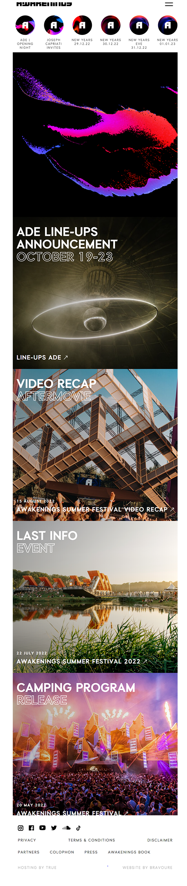
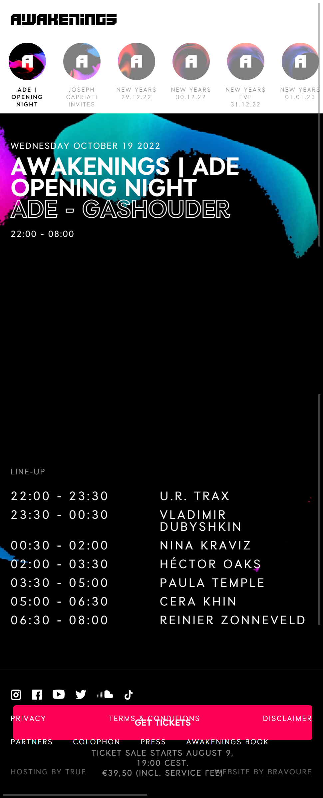
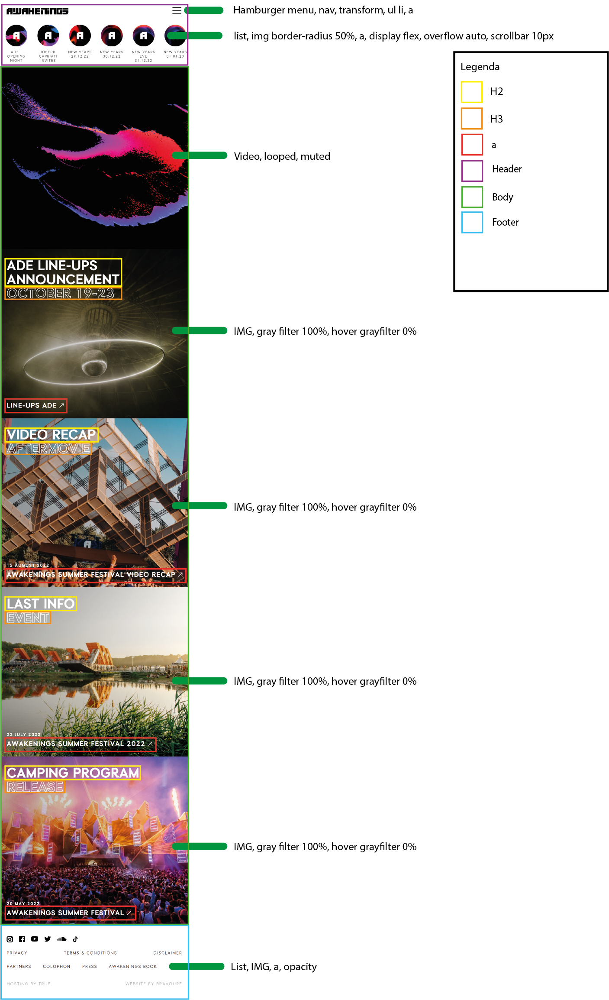
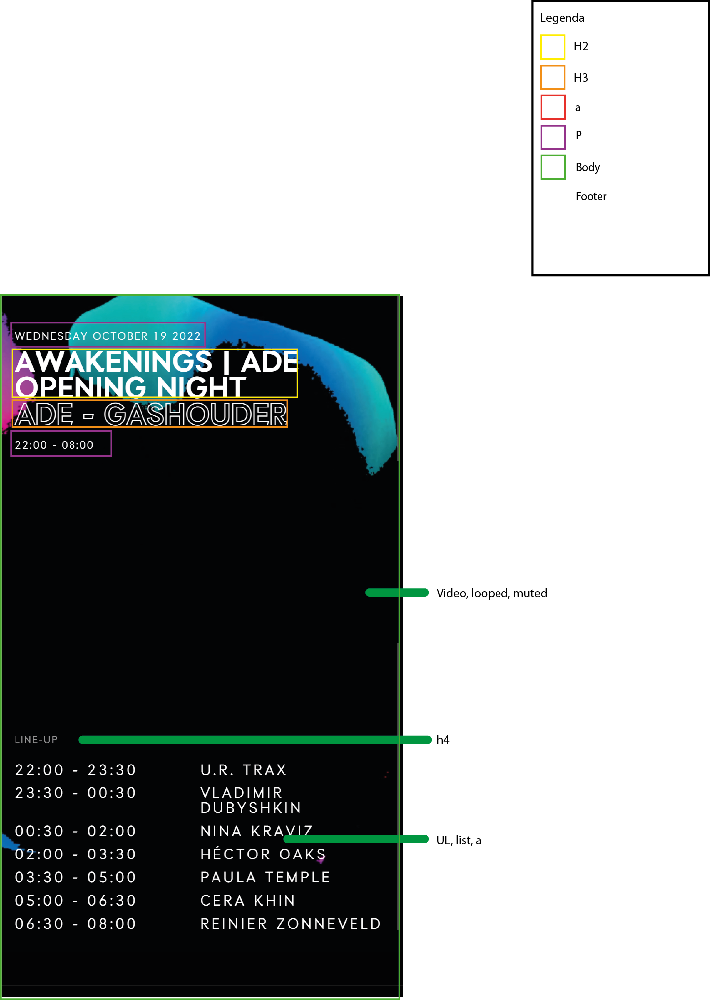

# Procesverslag
Markdown is een simpele manier om HTML te schrijven.  
Markdown cheat cheet: [Hulp bij het schrijven van Markdown](https://github.com/adam-p/markdown-here/wiki/Markdown-Cheatsheet).

Nb. De standaardstructuur en de spartaanse opmaak van de README.md zijn helemaal prima. Het gaat om de inhoud van je procesverslag. Besteedt de tijd voor pracht en praal aan je website.

Nb. Door *open* toe te voegen aan een *details* element kun je deze standaard open zetten. Fijn om dat steeds voor de relevante stuk(ken) te doen.

## Jij

  
uitwerken voor kick-off werkgroep

  ### Auteur:
  Frank (vervangen door jouw naam)

  #### Je startniveau:
  rood

  #### Je focus:
  Betere kennes over de code zelf krijgen, en niet typen en hopen dat het werkt.
 

## Je website

  
uitwerken voor kick-off werkgroep

  ### Je opdracht:
  https://www.awakenings.com/en/

  #### Screenshot(s) van de eerste pagina (small screen): 
  Homepage 
  

  #### Screenshot(s) van de tweede pagina (small screen):
  ade night 
  
 

## Toegankelijkheidstest 1/2 (week 1)

  
uitwerken na test in 1e werkgroep

  ### Bevindingen
  Lijst met je bevindingen die in de test naar voren kwamen:

  #### Screenreader
  De screenreeder gaat goede volgorde af. er word duidelijke opgenoemd wat wat is

  #### Muis en Toetsenbord 
  De website is met toetsenbord en muis goed afgaanbaar en ik ervaarde hierin geen problemen

  #### Motoriek (shocks, elastiekjes)
  Door de schokken kon je af en toe per ongeluk je muis inklikken en
  naar een pagina gaan wat niet de bedoeling was.
  
  afbeelding met wat er er precies klikbaar is:

  oplossing:
  Niet het hele plaatje klikbaar maken, maar alleen de titel.

  #### Visueel (brillen, contrast, kleurenblind, dark/light). 

  Het kleurenblind effect zorgt voor niet een verschil wat de website ongebruiker maakt voor de user. De site zit vol kleuren, met niet 1 "officiele" kleur. Ook zijn     de letters en afbeelding erg groot, dus zelfs met een blur of gedeeltelijk kleurverlies is het meeste van de sit nog steeds zichtbaar en goed te gebruiken.
  

## Breakdownschets (week 1)

  
uitwerken na afloop 2e werkgroep

  ### de hele pagina: 
  
  
  

  ### dynamisch deel (bijv menu): 
  

## Voortgang 1 (week 2)

  
uitwerken voor 2e voortgang

  ### Stand van zaken
  hier dit ging goed & dit was lastig (neem ook screenshots op van delen van je website en code)

  Ik had de afbeeldig en video strak onder elkaar gekregen. Het zoomde in en veranderde van kleur net zoals bij de awakenings site. Ik heb de juiste font en text style overgenomen. Het is me nog niet gelukt om de awakenings logo, wat een vector is, voor de video te krijgen. Ook wilt de h2,3 en 4 niet dezelfde left waarde aannemen.

  ### Agenda voor meeting
  samen met je groepje opstellen

  | student 1                                               | student 2          | student 3    | student 4        |
  | bespreken wat ik moest doen omdat ik achterliep         | ---                | ---          | ---              |
  |                                                         | en dit             | en ik dit    | en dan ik dat    |
  |                                                         | dit als er tijd is | nog een punt | dit wil ik zeker |
  | ...                                                     | ...                | ...          | ...              |

  ### Verslag van meeting
  hier na afloop snel de uitkomsten van de meeting vastleggen

Punten

Ik had mijn website niet online gezet op github, dit moet ik nog doen. De readme was nog niet genoeg aangevuld.
Op bepaalde plekken had ik een <h4> gebruikt ipv een <a>. Ook had ik breaks toegevoegd, maar dit kon ik makkelijker oplossen doormiddel van een nieuw
h2 elementje. Om te voorkomen dat de browsers waarde meegaf heb ik een css reset toegevoegd. Ook inplaats van divjes :nth-of-type gebruiken.

## Voortgang 2 (week 3)

  
uitwerken voor 3e voortgang

  ### Stand van zaken
  hier dit ging goed & dit was lastig (neem ook screenshots op van delen van je website en code)

  Ik heb een slider boven in het menu toegevoegd met een paar items die op de site stonden. Ik kreeg in eerste instantie de scrollbar niet weg, maar daar heeft Russel   mij mee geholpen met het volgende stukje code: 
  ::-webkit-scrollbar{
  width: 10px;
  }
  Dit zorgt ervoor dat die niet zichtbaar is.

  Bij de slider van de header heb ik de tekst een donkerdere kleur zwart gegeven, wat meer witruimte en een text-shadow (text-shadow: 1px 1px 0px black;) zodat het       beter leesbaar is.
  Awakenings versie:

 
 
  Mijn versie:

  
 
   Wat ik heb toegevoegd deze week is een text-shadow aan de alle tekst op de plaatjes behalve de h3’s. Dit waren transparante letters met een stroke, als ik hierbij   een normale text-shadow toevoegde werd de binnenkant zwart. Dit heb ik anders gedaan, namelijk met een svg filter:
h2,h4,p, section {
    text-shadow: 1px 1px 0px black;
  }
  
  h3{
    filter: drop-shadow(1px 1px 0px rgb(0 0 0 / 0.4));
  }

Hierna heb ik de footer toegevoegd. Op de Awakenings website ziet de footer er als volgt uit:
  
   

 
Ik heb ervoor gekozen om de footer wat groter te maken qua tekst, de afbeelding van de social media groter en meer verspreid, zodat ze makkelijker klik baar zijn. Dat ziet er als volgt uit:
  
   

  ### Agenda voor meeting
  samen met je groepje opstellen

  | student 1                       | student 2          | student 3    | student 4        |
  | Mijn html tabbaar maken         | alles clickbaar maken, stijl van slider aanpassen, tekst blij klok              | ---          | ---              |
  | dit bespreken                   | en dit             | en ik dit    | en dan ik dat    |
  | en dat ook nog                  | dit als er tijd is | nog een punt | dit wil ik zeker |
  | ...                             | ...                | ...          | ...              |

  ### Verslag van meeting
  hier na afloop snel de uitkomsten van de meeting vastleggen

  - punt 1
  - punt 2
  - nog een punt
  - ...

## Toegankelijkheidstest 2/2 (week 4)

  
uitwerken na test in 8e werkgroep

  ### Bevindingen
  Lijst met je bevindingen die in de test naar voren kwamen (geef ook aan wat er verbeterd is):

  #### Screenreader
  Hier korte omschrijving (met indien nodig afbeeldingen)

  de kopjes worden overgeslagen inclusief de footer.

  Oplossing:
  Ik had nog niet correct door hoe screenreader werkte. Na een klein onderzoekje bleek alles toch tabbaar.

  #### Muis en Toetsenbord 

  tab: Met de tab komt die alleen maar bij de a van de plaatjes van events.
  Blur: de kleine tekst en de transparante tekst word bij sommige delen onleesbaar.
  
  

  Hier een omschrijving van hoe het opgelost kan worden (met indien nodig afbeeldingen)
  contrast verhogen

  #### Motoriek (shocks, elastiekjes)
  Eerst op de site merkte ik dat ik overal op klikte omdat de hele afbeelding een knop was. wat ik aangepast dat ik 
  geen header gemaakt had van de onderste tekst, maar een atje die al enige een link heeft. waardoor je specifieker
  moet klikken

 

  #### Visueel (brillen, contrast, kleurenblind, dark/light). 

  geteste brillen: Half zicht, tunnelvisie, low contrast.
  De brillen heinfield loss, central field loss, combined field loss & peripheral field loss hebben geen effect op de site, het is nog steeds goed zichtbaar.
  lowcontrast, color#0779p en blur  zorgen ervoor dat de site slecht leesbaar is.

  Hier een omschrijving van hoe het opgelost kan worden (met indien nodig afbeeldingen)
  Een hogere contrast zou dit verhelpen

## Voortgang 3 (week 4)

  
uitwerken voor 3e voortgang

  
  De site de vormgeving komt bijna helemaal overheen op een paar dingetjes na. De button laten verdwijnen doormiddel van te scrollen is me nog niet gelukt.
  

  ### Stand van zaken
  hier dit ging goed & dit was lastig (neem ook screenshots op van delen van je website en code)

  ### Agenda voor meeting
  samen met je groepje opstellen

  | student 1                       | student 2          | student 3    | student 4        |
  | padding wegkrijgen              | alles clickbaar maken, stijl van slider aanpassen, tekst blij klok              | ---          | ---              |
  | time element?                   | en dit             | en ik dit    | en dan ik dat    |
  | hoe krijg ik een button weg-    | dit als er tijd is | nog een punt | dit wil ik zeker |
  | door te scrollen                | ...                | ...          | ...              |

  ### Verslag van meeting
  hier na afloop snel de uitkomsten van de meeting vastleggen

  - table element gebruiken
  - evenetueel Intersection_Observer_API gebruiken om te scrollen
 

## Eindgesprek (week 5)

  
uitwerken voor eindgesprek

  ### Je uitkomst - karakteristiek screenshots:
  
  
  

  ### Dit ging goed/Heb ik geleerd: 
  Korte omschrijving met plaatjes
  Ik had de vormgeving van de website zelf sneller na kunnen maken dan gedacht. Ik heb geleerd op welke websites in ik nou nuttige informatie kan vinden, 
  en welke niet. 

  

  ### Dit was lastig/Is niet gelukt:
  Korte omschrijving met plaatjes
  
  Het is me niet gelukt om de knop de laten verdwijnen tijdens het scrollen. Door ziekte was ik af en toe niet in de les en dan merk je snel
  dat je een achterstand opbouwt wat geen fijn begin was.

  

## Bronnenlijst

  
continu bijhouden terwijl je werkt

Flexbox - Learn web development | MDN. (2022, 19 september). Geraadpleegd op 3 oktober 2022, van https://developer.mozilla.org/en-US/docs/Learn/CSS/CSS_layout/Flexbox 

Juviler, J. (2022, 16 mei). How to Create a Video Background With CSS. Geraadpleegd op 3 oktober 2022, van https://blog.hubspot.com/website/video-background-css 

Olawanle, J. (2021, 11 juni). Adding Shadows to SVG Icons With CSS and SVG Filters. CSS-Tricks. Geraadpleegd op 3 oktober 2022, van https://css-tricks.com/adding-shadows-to-svg-icons-with-css-and-svg-filters/

freefontsdownload.net. (z.d.). Download free Auxilia-Black font, free Auxilia-Black.otf &  font for Windows. Geraadpleegd op 3 oktober 2022, van https://freefontsdownload.net/free-auxilia-black-font-168608.html

Contrast knop animatie - https://codepen.io/leptr/pen/eYgOWBO

